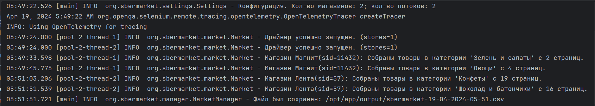
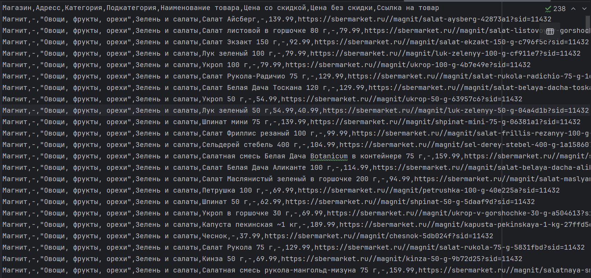

# Sbermarket

Парсер онлайн-магазина Сбермаркет


## Переменные окружения

Для запуска приложения потребуеются положить в файл ```.env``` следующие переменные:
- `THREADS` - кол-во потоков
- `SBERMARKET_URL` - корневая ссыла на сбермаркет
- `GRID_URL` - ссылка на подключение к селениум грид

## Запуск

Для запуска понадобится докер.

### Запуск приложения через докер

```bash
  git clone https://github.com/aquarell-dev/sber-parser.git
```
```bash
  cd sber-parser
```
```bash
  docker compose build
```
```bash
  docker compose up
```

## Конфигурация

Для конфигурации парсера есть файлик `stores.json`, который лежит в папке `resources`

### Пример файл `stores.json`

```json
{
  "11432": {
    "store": "Магнит",
    "categories": [
      {
        "category": "Овощи, фрукты, орехи",
        "subCategory": "Зелень и салаты",
        "link": "magnit/c/ovoshchi-frukti-orekhi/zelen-salati-n?sid=11432",
        "isAdult": false
      },
      {
        "category": "Овощи, фрукты, орехи",
        "subCategory": "Овощи",
        "link": "magnit/c/ovoshchi-frukti-orekhi/ovoshchi?sid=11432",
        "isAdult": false
      }
    ]
  }
}
```
## Результат работы парсера

Результатом работы парсера является `.csv` файлик, который лежит в директории `output`




